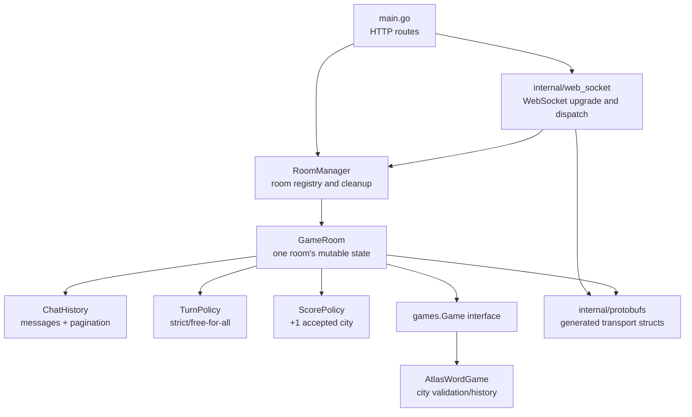
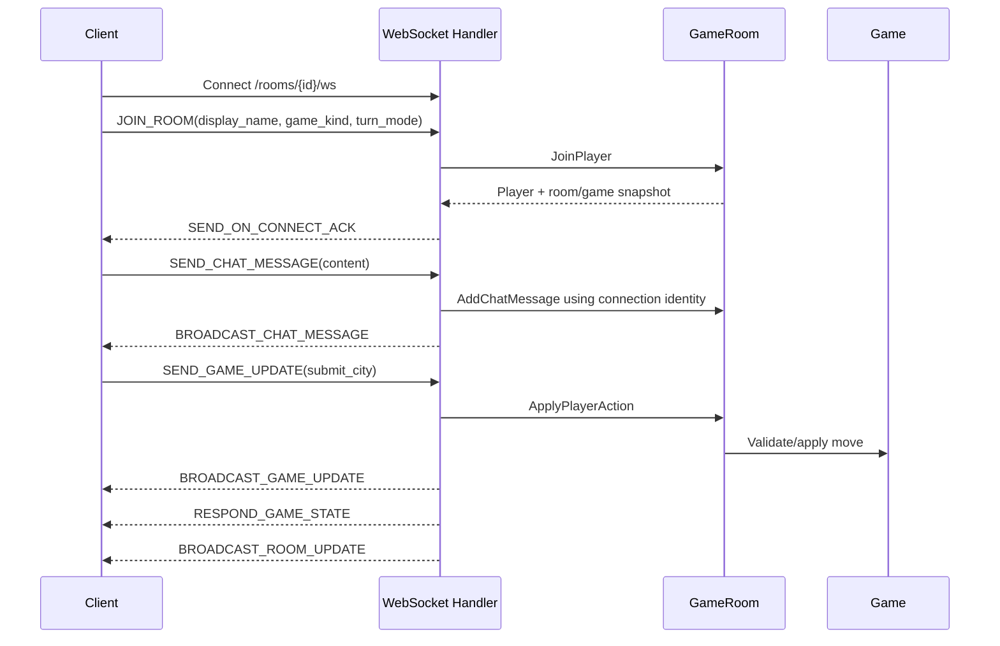
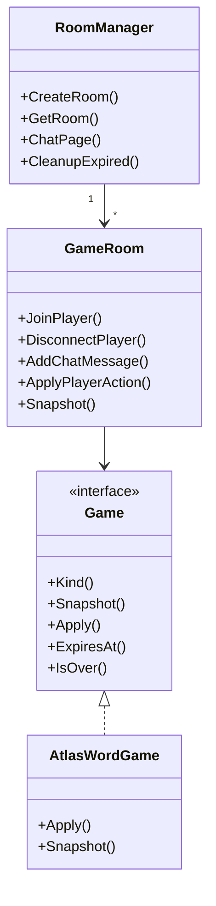
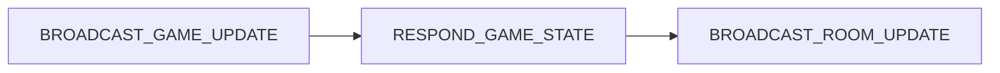

# Atlas Backend AI Agent Guide

`atlas-backend` is the authoritative multiplayer service for Atlas rooms. It owns room lifecycle, player identity, chat history, turn sequencing, scoring, game snapshots, and Atlas city validation.

## Backend Architecture



## Routes

- `GET /create?gameKind=atlas-word&turnMode=strict-turns`: creates an in-memory room and returns room metadata.
- `GET /rooms/{roomId}/ws`: upgrades to a plain WebSocket using binary protobuf frames.
- `GET /rooms/{roomId}/chat?limit=50&before=<messageId>`: returns room-scoped chat history latest-first.

`ATLAS_PORT` overrides the default `8080`.

## WebSocket Flow



Rejected joins or moves send typed `SEND_ERROR` messages. Rejected moves must not mutate game history, score, turn, or player metadata.

## Package Responsibilities

- `main.go`: route registration, JSON responses, room creation endpoint, cleanup loop.
- `internal/game_room`: `RoomManager`, `GameRoom`, player metadata, chat history, turn policy, scoring, room/game snapshots, cleanup and expiry.
- `internal/games`: generic `Game` interface and `atlas-word` implementation.
- `internal/protobufs/assets`: `.proto` source of truth.
- `internal/protobufs`: generated Go protobuf files; do not edit manually.
- `internal/web_socket`: WebSocket upgrade, join handshake, protobuf dispatch, response/broadcast helpers.
- `tests/test_client.go`: manual client, not part of `go test`.

## Game Room State



Room state is in memory and guarded by mutexes. Do not access player, chat, or game state without using the room/manager methods or matching lock discipline.

## Protocol Contract

Client to server:

- `JOIN_ROOM`
- `SEND_CHAT_MESSAGE`
- `REQUEST_GAME_STATE`
- `SEND_GAME_UPDATE`

Server to client:

- `SEND_ON_CONNECT_ACK`
- `BROADCAST_CHAT_MESSAGE`
- `BROADCAST_GAME_UPDATE`
- `RESPOND_GAME_STATE`
- `BROADCAST_ROOM_UPDATE`
- `SEND_ERROR`

Accepted move event ordering is fixed:



## Adding Backend Features

For protocol changes, edit `internal/protobufs/assets/*.proto`, regenerate Go protobufs, regenerate frontend protobufs, then update handlers and tests.

For new games, implement `games.Game`, add the `gameKind` to `games.NewGame`, provide action validation, snapshot data, completion rules, and any game-specific scoring or turn behavior. See `FUTURE_GAMES.md`.

## Verification

```powershell
$env:GOCACHE = "D:\Huehue\atlas\.gocache"
go test ./...
go test -race ./...
```

The race test requires a local C compiler. CI runs backend tests from `.github/workflows/ci.yml`.
