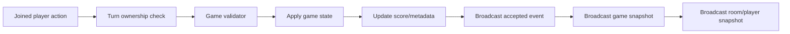
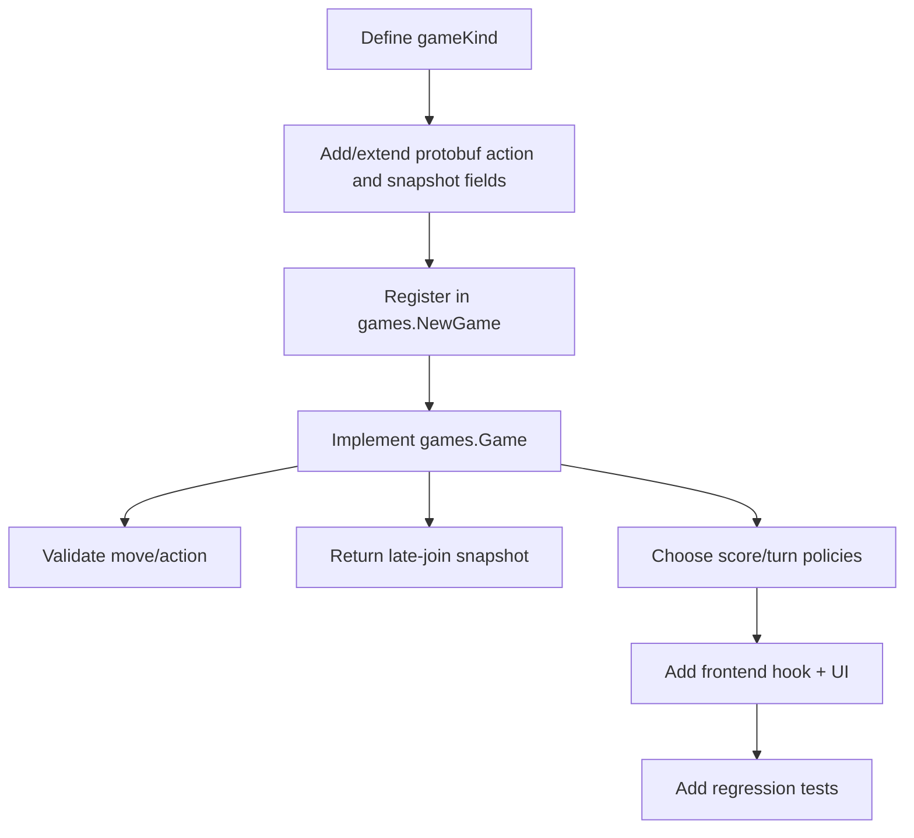
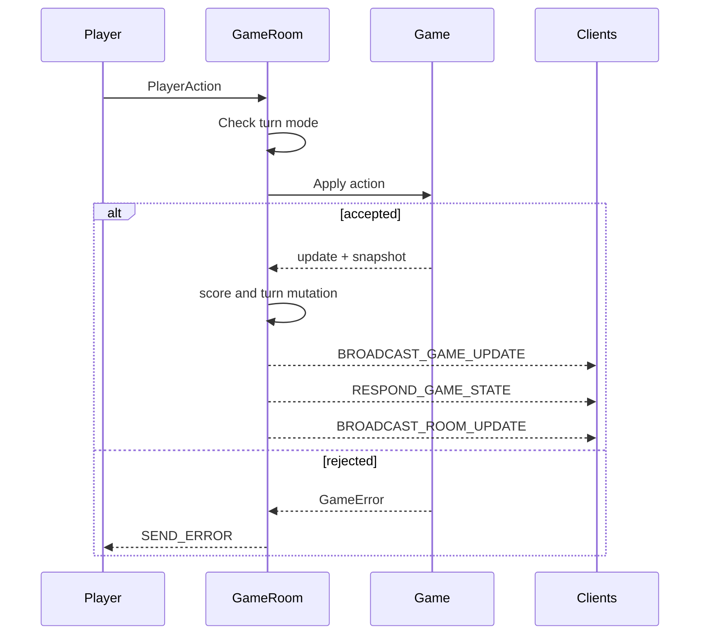
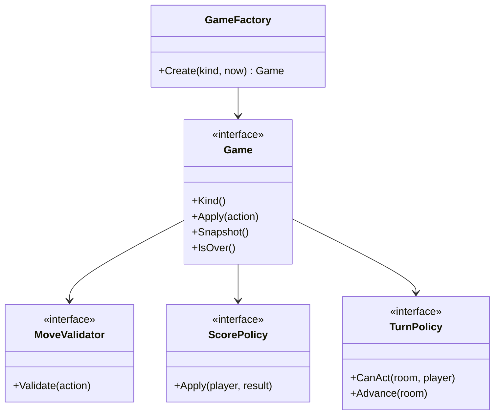

# Future Games

Atlas multiplayer is intended to reuse the same room infrastructure for multiple games. The reusable loop is:

1. Receive a joined player action.
2. Check turn ownership for the room mode.
3. Validate the move in the game implementation.
4. Apply game state and score/metadata changes.
5. Broadcast the accepted move event.
6. Broadcast the latest game snapshot.
7. Broadcast the latest room/player snapshot.

## Reusable Primitives

- Rooms own players, websocket connections, chat history, turn mode, status, expiry, and game instance.
- Players own display name, score, hearts, join time, last seen time, and connection status.
- Chat is room-scoped, persisted in memory, and paginated latest-first through `/rooms/{roomId}/chat`.
- Turn modes are room metadata. `strict-turns` advances in connected-player join order, while `free-for-all` lets any connected player submit.
- Snapshots are the late-join contract: the ACK must include room metadata, players, scores, current turn, and current game state.

## Adding A Game

Add a new game by implementing the `games.Game` interface and registering it in `games.NewGame`.

Required pieces:

- `gameKind` string used in proto payloads and frontend routing.
- Action types and payload fields needed by the game.
- Move validator that rejects malformed, duplicate, illegal, or out-of-turn moves.
- Score policy, either room-level or game-specific.
- Turn policy needs, if the game should override strict round-robin.
- Snapshot payload containing enough current state/history for late joiners to render.
- Completion rules such as move limit, score limit, timeout, or manual end.

## Standard Event Flow

Accepted moves should keep this order so clients hydrate predictably:

1. `BROADCAST_GAME_UPDATE` for the accepted move.
2. `RESPOND_GAME_STATE` with the full current game snapshot.
3. `BROADCAST_ROOM_UPDATE` with updated player score/turn metadata.

Rejected moves should send a typed `SEND_ERROR` and should not mutate score, turn, or game history.

## Late Join Contract

When a player joins an existing room, the ACK should include:

- Room id, game kind, turn mode, status, max players, created/started/expires timestamps.
- All current players with display names, scores, hearts, connection status, and join order.
- Current active turn player when strict turns are enabled.
- Current game snapshot with enough accepted/recent history to render the board.
- Chat is fetched separately through the chat-history endpoint to keep ACKs bounded.

## Recommended Registry Shape

Future hardening can move from the current switch factory to a registry:

- `GameFactory` creates game state from `gameKind`.
- `MoveValidator` validates game actions before mutation.
- `ScorePolicy` maps accepted actions to player score changes.
- `TurnPolicy` controls who can act and how turns advance.
- Snapshot mappers keep protobuf transport structs outside deeper game rules where domain structs are clearer.

