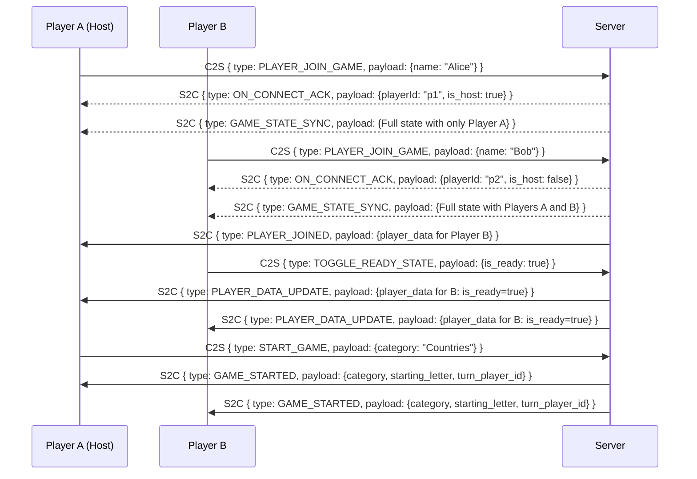

# Atlas Gameplay - Refined Plan

This document outlines a simplified and robust plan for the Atlas gameplay backend, covering architecture, real-time events, and data schemas.

## 1. Architecture & Protocol Choices

To ensure a responsive and scalable game, we will use a combination of HTTP and WebSockets.

-   **HTTP REST API**: Used for stateless, request-response actions that are not time-critical. This is ideal for initiating game rooms and discovering them.
    -   `POST /create`: Creates a new game room.
    -   `GET /rooms`: Lists available public rooms.
    -   `GET /health`: Service health check.
-   **WebSockets with Protobuf**: Used for all real-time, stateful gameplay events. WebSockets provide a persistent, low-latency, bidirectional connection necessary for interactive gaming. Using Protocol Buffers (Protobuf) for message serialization is highly efficient and strongly typed, reducing bandwidth and preventing data errors.

## 2. Core Gameplay Concepts

-   **Room Host**: The first player in a room is the host, with exclusive rights to start the game.
-   **Readiness**: Players must mark themselves as "Ready" before the host can start the game.
-   **Unified State Sync**: To simplify client logic, both new and reconnecting players receive a single, comprehensive `GAME_STATE_SYNC` message upon joining. This ensures they have the complete game state without needing to process a history of events.

## 3. User Flow Diagrams (Mermaid)

### Scenario 1: Player Joins and Game Start


### Scenario 2: Player Reconnects
```mermaid
sequenceDiagram
    participant ClientA as Player A
    participant ClientB as Player B
    participant Server

    Note over ClientA, Server, ClientB: Player A disconnects.
    Server->>ClientB: S2C { type: PLAYER_DATA_UPDATE, payload: {player_data for A: is_connected=false} }

    Note over ClientA, Server, ClientB: Player A reconnects to the same Room ID.
    ClientA->>Server: C2S { type: RECONNECT_PLAYER, payload: {player_id: "p1"} }
    Server-->>ClientA: S2C { type: GAME_STATE_SYNC, payload: {Full current game state} }
    Server->>ClientB: S2C { type: PLAYER_DATA_UPDATE, payload: {player_data for A: is_connected=true} }
```

## 4. WebSocket Event Reference

The tables below define the `MessageType` enums that are critical for identifying the event being sent. The enums are grouped by function for clarity.

### Client-to-Server (C2S) Events
| MessageType Group | Enum | Description |
| :--- | :--- | :--- |
| **Connection** | `PLAYER_JOIN_GAME` | A new player joins a room. |
| | `RECONNECT_PLAYER` | An existing player reconnects. |
| **Lobby** | `TOGGLE_READY_STATE`| A player toggles their ready status. |
| | `START_GAME` | **Host only.** Requests to start the game. |
| **Gameplay** | `SUBMIT_WORD` | A player submits a word on their turn. |
| | `USE_POWER_UP` | A player uses an acquired power-up. |

### Server-to-Client (S2C) Events
| MessageType Group | Enum | Target | Description |
| :--- | :--- | :--- | :--- |
| **Connection & Sync**| `ON_CONNECT_ACK` | Single Client | Acknowledges connection and provides essential IDs. |
| | `GAME_STATE_SYNC` | Single Client | **Primary data load.** Sent to a joining/reconnecting player. |
| **Broadcasts** | `PLAYER_JOINED` | Broadcast | Informs players that a new player has arrived. |
| | `PLAYER_LEFT` | Broadcast | Informs players that a player has disconnected. |
| | `PLAYER_DATA_UPDATE`| Broadcast | Broadcasts a change to a single player's state. |
| | `GAME_STARTED` | Broadcast | Announces the game has begun. |
| | `TURN_CHANGE` | Broadcast | Signals the start of the next turn. |
| | `GAME_OVER` | Broadcast | Announces the end of the game with final scores. |
| **Notifications** | `WORD_VALIDATION_RESULT`| Single Client | Informs the submitting player if their word was valid. |
| | `ERROR_MESSAGE` | Single Client | Sends a recoverable error to a specific client. |

## 5. Protobuf Schema Definitions

### Core Data Structures
```protobuf
// PowerUpType.proto
enum PowerUpType {
  POWER_UP_TYPE_UNSPECIFIED = 0;
  SKIP_TURN = 1;
  EXTRA_TIME = 2;
}

// PlayerData.proto
message PlayerData {
  string player_id = 1;
  string name = 2;
  int32 hearts = 3;
  int32 score = 4;
  bool is_ready = 5;
  bool is_connected = 6;
  repeated PowerUpType available_power_ups = 7;
}
```

### Main Message Wrappers (with Grouped MessageType Enums)
To improve readability and maintainability, the message types are grouped by function using a numerical convention.

```protobuf
// client_server_message.proto
enum ClientServerMessageType {
  C2S_UNKNOWN = 0;

  // Connection & Session (100-199)
  PLAYER_JOIN_GAME = 101;
  RECONNECT_PLAYER = 102;

  // Lobby Actions (200-299)
  TOGGLE_READY_STATE = 201;
  START_GAME = 202;

  // Gameplay Actions (300-399)
  SUBMIT_WORD = 301;
  USE_POWER_UP = 302;
}

message ClientServerMessage {
  ClientServerMessageType message_type = 1;
  oneof payload {
    PlayerJoinGamePayload player_join_game = 2;
    ReconnectPlayerPayload reconnect_player = 3;
    ToggleReadyStatePayload toggle_ready_state = 4;
    StartGamePayload start_game = 5;
    SubmitWordPayload submit_word = 6;
    UsePowerUpPayload use_power_up = 7;
  }
}

// server_client_message.proto
enum ServerClientMessageType {
  S2C_UNKNOWN = 0;

  // Connection & Sync (100-199)
  ON_CONNECT_ACK = 101;
  GAME_STATE_SYNC = 102;

  // Player & Lobby Broadcasts (200-299)
  PLAYER_JOINED = 201;
  PLAYER_LEFT = 202;
  PLAYER_DATA_UPDATE = 203;

  // Game Flow Broadcasts (300-399)
  GAME_STARTED = 301;
  TURN_CHANGE = 302;
  GAME_OVER = 303;

  // Targeted Responses & Notifications (400-499)
  WORD_VALIDATION_RESULT = 401;
  ERROR_MESSAGE = 402;
}

message ServerClientMessage {
  ServerClientMessageType message_type = 1;
  oneof payload {
    OnConnectAckPayload on_connect_ack = 2;
    GameStateSyncPayload game_state_sync = 3;
    PlayerJoinedPayload player_joined = 4;
    PlayerLeftPayload player_left = 5;
    PlayerDataUpdatePayload player_data_update = 6;
    GameStartedPayload game_started = 7;
    TurnChangePayload turn_change = 8;
    WordValidationResultPayload word_validation_result = 9;
    GameOverPayload game_over = 10;
    ErrorMessagePayload error_message = 11;
  }
}
```

### Event Payloads
```protobuf
// Payloads.proto

// C2S Payloads
message PlayerJoinGamePayload { string player_name = 1; }
message ReconnectPlayerPayload { string player_id = 1; }
message ToggleReadyStatePayload { bool is_ready = 1; }
message StartGamePayload { string category = 1; }
message SubmitWordPayload { string word = 1; }
message UsePowerUpPayload { PowerUpType power_up_type = 1; }

// S2C Payloads
message OnConnectAckPayload { string room_id = 1; string player_id = 2; bool is_host = 3; }
message PlayerJoinedPayload { PlayerData player_data = 1; }
message PlayerLeftPayload { string player_id = 1; }
message PlayerDataUpdatePayload { PlayerData player_data = 1; }
message GameStartedPayload { string category = 1; string starting_letter = 2; string turn_player_id = 3; int32 turn_duration_seconds = 4; }
message TurnChangePayload { string next_player_id = 1; string last_word = 2; string next_letter = 3; }
message WordValidationResultPayload { bool is_valid = 1; string reason = 2; }
message GameOverPayload { string winner_player_id = 1; map<string, int32> scores = 2; }
message ErrorMessagePayload { string message = 1; }

// The main sync payload
message GameStateSyncPayload {
  string room_id = 1;
  string category = 2;
  bool is_started = 3;
  bool is_over = 4;
  string turn_player_id = 5;
  string current_letter = 6;
  string last_word = 7;
  repeated PlayerData players = 8;
  int64 turn_start_timestamp = 9;
}
```
